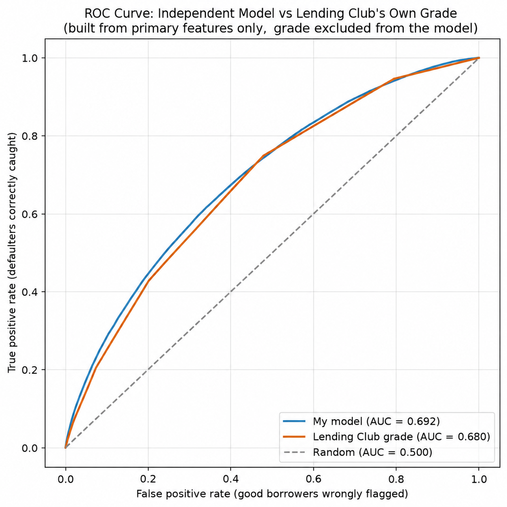
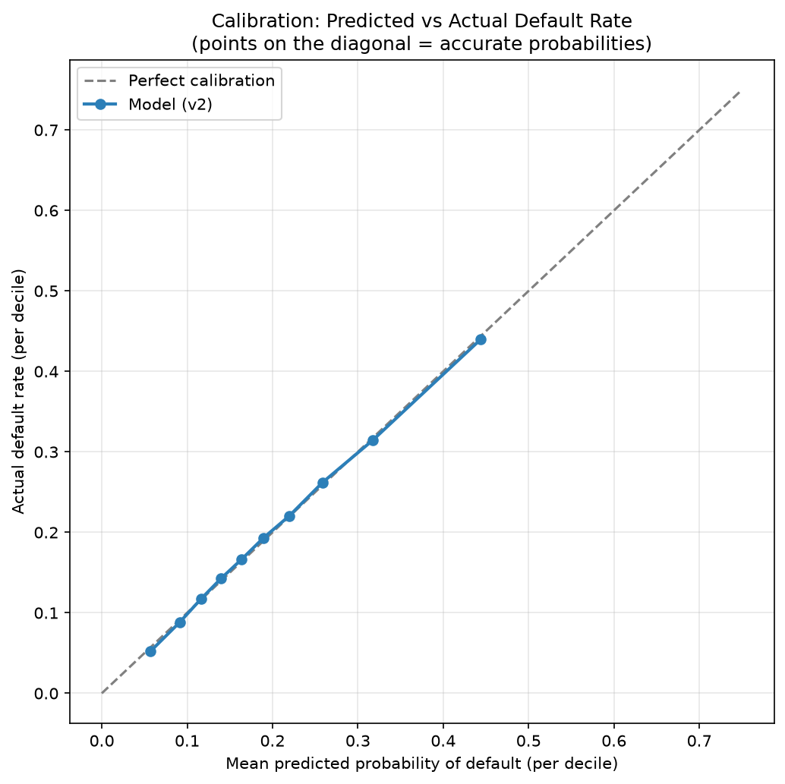
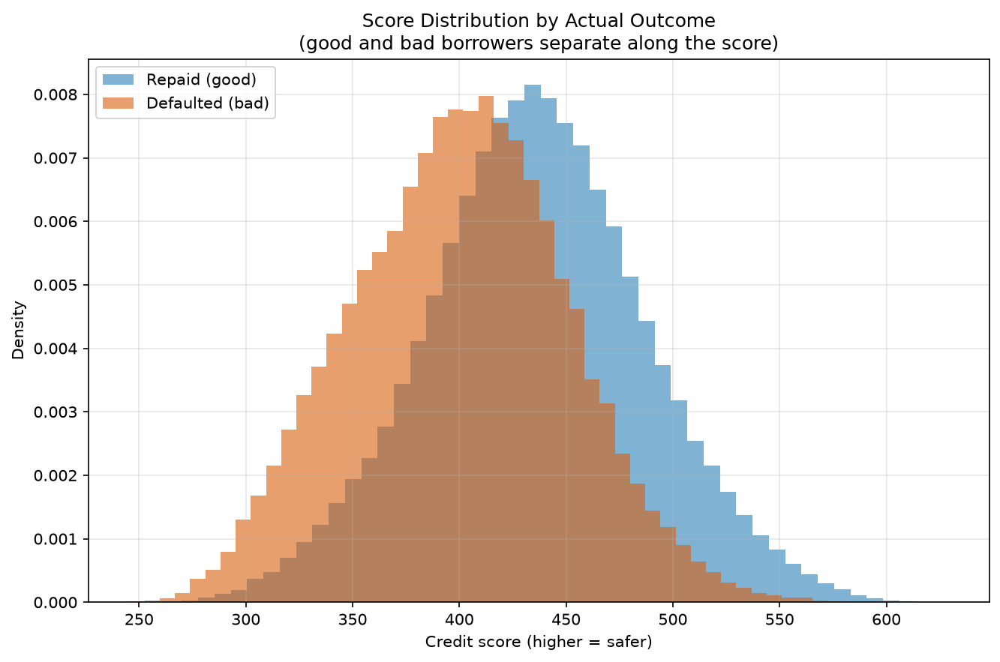

# Credit Risk Scorecard: Lending Club
 
A probability-of-default (PD) model and application scorecard built from the Lending Club loan book (2007–2018), using Weight of Evidence (WOE) binning and logistic regression. The model is built entirely from **primary application features** (Lending Club's own risk grade is deliberately excluded from the model and used only as an external benchmark.)
 
## Headline results
 
| Metric | Final model (v2) | Lending Club grade |
|---|---|---|
| AUC | 0.692 | 0.680 |
| Gini | 0.385 | 0.359 |
| KS | 27.7 | — |
 
- **Matches Lending Club's proprietary risk grade** on the held-out test set, using only primary application features (FICO, DTI, income, employment, credit history) rather than the platform's pre-computed grade.
- **Well calibrated**: predicted default probabilities track actual default rates within ~0.5 percentage points across all ten risk deciles. the model's probabilities are accurate, not just correctly ranked.
- Delivered as a scaled scorecard (higher score = safer borrower, CIBIL-style).
## Why exclude Lending Club's grade?
 
Lending Club's `grade` is itself the output of a risk model, derived from the same application data used here. Including it would mean re-predicting Lending Club's assessment rather than building an independent one, the model would score well while demonstrating nothing.
 
Grade (and its derivatives `sub_grade`, `int_rate`, `installment`) is therefore excluded from the feature set. It is retained separately and used as an **external benchmark**: after training, the independent model is compared against grade on the same test set. This turns "is the model any good?" into a concrete question: how close does an independent scorecard get to the platform's own grade?. This resulted in comparable performance from primary features alone.
 

 
The two ROC curves sit almost on top of each other, with the independent model (blue) tracking and marginally edging Lending Club's grade (orange) across the full range. Grade's curve is visibly stepped, it is a coarse 7-level rating, while the model's continuous score fills in the gradations, which is where the small edge comes from.
 
## Method
 
**Target definition.** Filtered the loan book to resolved loans only. Charged Off and Default are labelled bad (1); Fully Paid is good (0). Unresolved statuses (Current, Late, In Grace Period) and credit-policy exceptions are dropped, since their outcomes are not yet known. Result: ~1.35M loans at a ~20% base default rate.
 
**Leakage removal.** Credit models must use only information available at the time of application. Rather than blacklisting post-origination fields, the project **whitelists** application-time features, a safer default, since anything uncertain is left out. This excludes payment, recovery, settlement, hardship, and outstanding-balance fields (all recorded after the loan is issued), plus free-text and high-cardinality columns.
 
**Cleaning.** Sentinel values were converted to missing before binning: `dti` contained −1 (impossible) and a 999 placeholder cluster; `revol_util` contained values far above any realistic utilisation. Economically impossible values were treated as sentinels; genuinely rare-but-real extremes (e.g. high incomes, high delinquency counts) were retained, since WOE binning handles them.
 
**WOE binning.** Each feature is binned and transformed to Weight of Evidence, computed on the training set only and applied to the test set. Binning was first implemented by hand on FICO as a reference, then automated across all features using OptBinning with monotonic constraints. Information Value (IV) was used to screen feature strength.
 
**Model.** Logistic regression on the WOE-transformed features. Coefficient signs were checked against WOE orientation as an economic sanity check.
 
## Multicollinearity: diagnosis and fix
 
The first model produced two coefficient anomalies: `pub_rec_bankruptcies` flipped sign (positive when it should be negative), and `total_acc` received an outsized coefficient (−2.26) despite one of the lowest IVs in the set.
 
Both are textbook multicollinearity. `pub_rec_bankruptcies` is a subset of `pub_rec` (bankruptcies are public records), and `total_acc` overlaps heavily with `open_acc` (total vs open account counts). When features carry near-identical information, the model splits credit between them and distorts the individual coefficients.
 
The two redundant siblings were dropped and the model refit (v2):
 
- Coefficient signs stabilised: `pub_rec` settled to a clean negative, and the inflated `total_acc` weight was removed.
- **Performance held**: AUC moved from 0.693 (v1) to 0.692 (v2), an immaterial change, confirming the dropped features were redundant rather than informative.
The result is a simpler, more interpretable model with no loss of discrimination. Model v2 is the final model.
 
## Evaluation
 
- **Discrimination**: AUC 0.692, Gini 0.385, KS 27.7. A working model, in the expected range for a scorecard built from primary features (excluding the platform's own grade).
- **Calibration**: test borrowers were split into deciles by predicted PD; average predicted probability tracks actual default rate within ~0.5pp in every decile (5.6% vs 5.2% at the low end; 44.5% vs 44.0% at the high end).
- **Benchmark**: the independent model matches Lending Club's grade on the same test set (AUC 0.692 vs 0.680). The honest reading is "comparable to, and marginally better than" grade: the margin is small, and grade is a coarse 7-level rating against the model's continuous score.

 
Every decile sits almost exactly on the diagonal, confirming the predicted probabilities are accurate in level, not merely correctly ranked.
 
## Scorecard
 
The model's log-odds are scaled to a points score (PDO = 50, reference 600 at 50:1 odds), oriented so that **higher score = lower risk**. Scores span roughly 245–628, with safe borrowers (low predicted PD) scoring high and risky borrowers scoring low.
 

 
Splitting the scored test set by actual outcome shows the two groups separating: defaulters skew toward lower scores and repaid loans toward higher scores. The distributions overlap in the middle, credit risk is not perfectly separable, which is exactly the trade-off a lender navigates when setting an approval cutoff.
 
## Notable findings
 
- **FICO's predictive power is modest here (IV ≈ 0.12), despite being a canonical credit predictor.** Lending Club pre-screens out sub-627 FICO applicants, so the low-FICO tail where the score discriminates most is absent, and the population clusters in the range where FICO separates least. OptBinning recovered some signal over coarse manual bins (IV 0.086 → 0.124), but the ceiling is set by the pre-screened population, not the binning.
- **No single feature carries the model.** After excluding grade, the strongest feature has an IV of only ~0.17; the model's discrimination comes from combining many individually-modest signals, which is both expected and more robust than leaning on one dominant feature.
## Limitations and extensions
 
- **Out-of-time validation.** The train/test split is random. A stronger test would train on earlier vintages and evaluate on later ones, mimicking real deployment (a model built on history, applied to the future). Lending standards shifted over 2007–2018, so an out-of-time split is the more realistic benchmark.
- **`earliest_cr_line` not yet used.** This date field would be converted to credit-history length (a known predictor) and added as a feature.
- **Harder benchmark.** Comparing against `sub_grade` (35 levels) rather than `grade` (7 levels) would be a more demanding test of the independent model.
## Repository
 
- `Finance_Project.ipynb`: the full analysis, from raw data to scorecard.
- `images/`: the plots shown above (calibration, ROC vs grade, score distribution).
- The raw data (`accepted_2007_to_2018Q4.csv.gz`, ~1.6GB uncompressed) is **not included**: download it from the [Lending Club dataset on Kaggle](https://www.kaggle.com/datasets/wordsforthewise/lending-club) and place it in the project root.
### Running
 
Requires Python 3.12. Install dependencies:
 
```
pip install pandas numpy scikit-learn optbinning matplotlib
```
 
Then run the notebook top to bottom (Restart & Run All).
 
## Stack
 
Python · pandas · scikit-learn · OptBinning · NumPy
